# @datex2/dx-type

[](https://www.npmjs.com/package/@datex2/dx-type)
[](LICENSE)
[](https://github.com/DATEx2/dx-type)
[](src/index.d.ts)
[](package.json)
[](https://datex2.github.io/dx-type/demo/)

> 🚀 **[Open Interactive Live Demo](https://datex2.github.io/dx-type/demo/)** | **[Explore `demo/index.html`](demo/index.html)**
>
> High-performance, zero-dependency **DATEx2 Web Components** for scroll-triggered typewriter animations, character reveals, batched numeric counters, and mechanical rolling drum odometers.

<p align="center">
  
</p>

Designed for instant zero-layout-shift rendering, single-rAF batching, JIT template unpacking via singleton `IntersectionObserver`, and GPU compositor-thread animations.

---

## 📑 Table of Contents

- [Overview & Visual Architecture](#-overview--visual-architecture)
- [Quick Start](#-quick-start)
- [Component Reference](#-component-reference)
  - [1. `<dx-type>` (Hero Typewriter)](#1-dx-type-hero-typewriter)
  - [2. `<dx-type-sda>` (Scroll-Driven Typewriter)](#2-dx-type-sda-scroll-driven-typewriter)
  - [3. `<dx-reveal>` (Hero Reveal)](#3-dx-reveal-hero-reveal)
  - [4. `<dx-reveal-sda>` (Scroll-Driven Reveal)](#4-dx-reveal-sda-scroll-driven-reveal)
  - [5. `<dx-type-ready>` (Hero Orchestrator)](#5-dx-type-ready-hero-orchestrator)
  - [6. `<dx-number>` (Animated Counter)](#6-dx-number-animated-counter)
  - [7. `<dx-odometer>` (Mechanical Drum Roll)](#7-dx-odometer-mechanical-drum-roll)
  - [8. `@datex2/dx-type/server` (SSR Tokenizer)](#8-datex2dx-typeserver-ssr-tokenizer)
- [Advanced Composition (Using Components Together)](#-advanced-composition-using-components-together)
  - [Embedded Odometer / Counter inside Typewriter (`.tw-embed`)](#-embedded-odometer--counter-inside-typewriter-tw-embed)
  - [Hero Banner Orchestration](#-hero-banner-orchestration)
  - [Scroll-Driven Storytelling (SDA)](#-scroll-driven-storytelling-sda)
- [CSS Keyframes Reference](#-css-keyframes-reference)
- [Performance & Architecture Guarantees](#-performance--architecture-guarantees)
- [Interactive Demo](#-interactive-demo)
- [TypeScript Support](#-typescript-support)
- [License](#-license)

---

## 🎨 Overview & Visual Architecture

```
                    ┌──────────────────────────────────────────────┐
                    │               HTMLElement                    │
                    └──────────────────────┬───────────────────────┘
                                           │
                    ┌──────────────────────▼───────────────────────┐
                    │                    DxBase                    │
                    │  • display: contents (layout safety)         │
                    │  • unpackTemplate() (JIT template loader)    │
                    └──────────┬───────────────┬────────────────┬──┘
                               │               │                │
            ┌──────────────────▼──┐   ┌────────▼────────┐   ┌───▼──────────────┐
            │       DxTyping      │   │   DxRevealing   │   │     DxMeter      │
            │ • JIT IO Singleton  │   │ • SDA Sensors   │   │ • uiNum Format   │
            │ • cleanupTypedDOM   │   │ • Reveal state  │   │ • Accessibility  │
            │ • markTyped()       │   │ • markRevealed()│   │ • makeStatic()   │
            └──────────┬──────────┘   └────────┬────────┘   └───┬──────────────┘
                       │                       │                │
           ┌───────────┴──────────┐     ┌──────┴───────┐   ┌────┴──────────────┐
           │                      │     │              │   │                   │
    ┌──────▼──────┐        ┌──────▼─────▼─┐     ┌──────▼───▼──┐         ┌──────▼────────┐
    │  <dx-type>  │        │<dx-type-sda> │     │ <dx-reveal> │         │  <dx-number>  │
    │ (Hero Dom)  │        │ (Scroll SDA) │     │ (Hero Fade) │         │ (rAF Batcher) │
    └─────────────┘        └──────────────┘     └─────────────┘         └───────────────┘
                                                       │                ┌───────────────┐
                                                ┌──────▼────────┐       │ <dx-odometer> │
                                                │<dx-reveal-sda>│       │ (Ribbon Roll) │
                                                │ (Scroll SDA)  │       └───────────────┘
                                                └───────────────┘
```

---

## ⚡ Quick Start

### Installation

```bash
npm install @datex2/dx-type
```

### 1. Import Components in JavaScript

```javascript
// Import all components (self-registers <dx-type>, <dx-number>, etc.)
import '@datex2/dx-type';

// Or import specific classes
import { DxNumber, DxOdometer, DxType } from '@datex2/dx-type/client';

// Server-side SSR tokenizer
import { tokenize } from '@datex2/dx-type/server';
```

### 2. Include Base CSS

In your CSS / SCSS file:
```css
@import '@datex2/dx-type/css';
```
Or in JavaScript (Vite / Webpack / Next.js):
```javascript
import '@datex2/dx-type/css';
```
Or via `<link>` in HTML:
```html
<link rel="stylesheet" href="node_modules/@datex2/dx-type/dist/css/dx-type.min.css">
```

---

## 🧩 Component Reference

---

### 1. `<dx-type>` (Hero Typewriter)

Animates text character-by-character on document timeline. The animation is triggered when an ancestor (or `<dx-type-ready>`) receives the `.type-ready` class.

#### HTML Syntax
```html
<dx-type style="--u: 40ms;">
  <template>
    <t>
      <w><c style="--I:0">H</c><c style="--I:1">e</c><c style="--I:2">l</c><c style="--I:3">l</c><c style="--I:4">o</c></w>
      <w><c style="--I:5">W</c><c style="--I:6">o</c><c style="--I:7">r</c><c style="--I:8">l</c><c style="--I:9">d</c></w>
    </t>
  </template>
  <s-t>Hello World</s-t>
</dx-type>
```

#### CSS Variables & Options
| Variable | Default | Description |
| :--- | :--- | :--- |
| `--u` | `40ms` | Unit delay per character. Lower value = faster typing. |
| `--I` | `0, 1, 2...` | Character index injected on each `<c>` tag for sequential delay. |

#### Lifecycle & States
* **Initial**: Displays search text `<s-t>` for SEO and zero CLS.
* **On `.type-ready`**: Unpacks `<template>`, steps through characters via `animation-delay: calc(var(--I) * var(--u))`.
* **On Complete**: Adds `.TYPED` class, cleans up DOM into clean text, removes temporary tags, and removes layout constraints.

---

### 2. `<dx-type-sda>` (Scroll-Driven Typewriter)

Typewriter animation driven purely by the user's scroll position via CSS Scroll-Driven Animations (`animation-timeline: view()`). 

#### HTML Syntax
```html
<dx-type-sda>
  <template>
    <t>
      <w><c style="--I:0">S</c><c style="--I:1">c</c><c style="--I:2">r</c><c style="--I:3">o</c><c style="--I:4">l</c><c style="--I:5">l</c></w>
      <w><c style="--I:6">m</c><c style="--I:7">e</c></w>
    </t>
  </template>
  <s-t>Scroll me</s-t>
</dx-type-sda>
```

#### Features
* **Zero JS on Scroll**: Animation progression runs directly on the browser's compositor thread (GPU).
* **JIT Template Unpack**: The `<template>` remains untouched in memory until the element is 200px from the viewport, unpacked once by the singleton `IntersectionObserver`.

---

### 3. `<dx-reveal>` (Hero Reveal)

Fade-in / slide-up reveal on document timeline, coordinated with hero typewriter elements.

#### HTML Syntax
```html
<dx-reveal style="--d: 300ms;">
  <h2>Subheading revealed after typewriter starts</h2>
</dx-reveal>
```

#### CSS Variables & Options
| Variable | Default | Description |
| :--- | :--- | :--- |
| `--d` | `0ms` | Delay before reveal animation begins (e.g. `250ms`). |

---

### 4. `<dx-reveal-sda>` (Scroll-Driven Reveal)

Fade-in / slide-up reveal attached to scroll timeline. Progresses smoothly as the element enters the viewport.

#### HTML Syntax
```html
<dx-reveal-sda>
  <div class="card">Reveals smoothly when scrolled into view</div>
</dx-reveal-sda>
```

---

### 5. `<dx-type-ready>` (Hero Orchestrator)

A `display: contents` wrapper that coordinates simultaneous start of hero typewriter, reveal, and counter elements. When `.type-ready` is set, all descendant animations start in unison with their respective delays.

#### HTML Syntax
```html
<dx-type-ready class="type-ready">
  <h1>
    <dx-type><!-- characters --></dx-type>
  </h1>
  <dx-reveal style="--d: 500ms;">
    <p>Subtitle fades in after 500ms</p>
  </dx-reveal>
</dx-type-ready>
```

---

### 6. `<dx-number>` (Animated Counter)

A smooth 60fps / 120fps numeric counter batched inside a centralized `requestAnimationFrame` loop.

#### HTML Syntax
```html
<!-- Integer with thousand spaces and Euro suffix -->
<dx-number type="number" percent="1299" suffix=" €" comma=","></dx-number>

<!-- Floating point with 1 decimal -->
<dx-number type="number-1dec" percent="98.5" suffix="%"></dx-number>

<!-- With start value -->
<dx-number type="number" start="100" percent="500" prefix="+ "></dx-number>
```

#### Attributes Reference
| Attribute | Type | Default | Description |
| :--- | :--- | :--- | :--- |
| `percent` / `value` | `number` | `0` | Target number to animate to. |
| `start` | `number` | `0` | Starting value of animation. |
| `type` | `string` | `'int'` | Formatting type: `'number'`, `'number-1dec'`, `'percent'`, `'year'`, `'int'`. |
| `comma` | `string` | `','` | Decimal separator character (e.g. `,` or `.`). |
| `prefix` | `string` | `''` | Text before number (e.g. `+ `, `– `). |
| `suffix` | `string` | `' €'` | Text after number (e.g. ` €`, ` %`, ` users`). |

#### JavaScript API
```javascript
const counter = document.querySelector('dx-number');

// Animate to 2450 over 800ms
counter.val(2450, 800);

// Instant set (0ms duration)
counter.val(500, 0);

// Read current value
console.log(counter.val()); // 500
```

---

### 7. `<dx-odometer>` (Mechanical Drum Roll)

Hardware-accelerated mechanical rolling drum odometer. Each digit rolls on its own ribbon track and automatically freezes to lightweight static HTML when the roll completes to release GPU memory.

#### HTML Syntax
```html
<!-- Year transition: 2018 -> 2026 -->
<dx-odometer type="year" start="2018" percent="2026"></dx-odometer>

<!-- Currency drum roll -->
<dx-odometer type="number" start="0" percent="1450" suffix=" €" comma=","></dx-odometer>
```

#### Attributes Reference
| Attribute | Type | Default | Description |
| :--- | :--- | :--- | :--- |
| `percent` / `value` | `number` | `0` | Target value to roll to. |
| `start` | `number` | `0` | Initial starting digits before roll. |
| `type` | `string` | `'int'` | Type: `'year'` (no thousand separators) or `'number'` / `'int'`. |

---

### 8. `@datex2/dx-type/server` (SSR Tokenizer)

Server-side utility for pre-tokenizing text into `<t><w><c style="--I:n">char</c></w></t>` HTML strings during SSR (Node.js, Next.js, Astro, Remix, Nuxt, Express).

#### Usage
```javascript
import { tokenize } from '@datex2/dx-type/server';

const html = tokenize('Build fast');
// Output:
// <t><w><c style="--I:0">B</c><c style="--I:1">u</c><c style="--I:2">i</c><c style="--I:3">l</c><c style="--I:4">d</c></w> <w><c style="--I:5">f</c><c style="--I:6">a</c><c style="--I:7">s</c><c style="--I:8">t</c></w></t>
```

---

## 🔗 Advanced Composition (Using Components Together)

### 🎪 Embedded Odometer / Counter inside Typewriter (`.tw-embed`)

You can embed `<dx-odometer>` or `<dx-number>` directly inside a typewriter character `<c>` element with the class `.tw-embed`. 

The embedded odometer/number will **pause its animation** until the typewriter sequence reaches its exact character position in the sentence, roll automatically, and then signal the typewriter to continue!

```html
<dx-type-ready class="type-ready">
  <dx-type style="--u: 35ms;">
    <template>
      <t>
        <w><c style="--I:0">S</c><c style="--I:1">i</c><c style="--I:2">n</c><c style="--I:3">c</c><c style="--I:4">e</c></w>
        <!-- Embedded Odometer rolling from 1990 to 2026 -->
        <w><c style="--I:5"><dx-odometer class="tw-embed" type="year" start="1990" percent="2026"></dx-odometer></c></w>
        <w><c style="--I:6">e</c><c style="--I:7">x</c><c style="--I:8">c</c><c style="--I:9">e</c><c style="--I:10">l</c><c style="--I:11">l</c><c style="--I:12">e</c><c style="--I:13">n</c><c style="--I:14">c</c><c style="--I:15">e</c></w>
      </t>
    </template>
    <s-t>Since 2026 excellence</s-t>
  </dx-type>
</dx-type-ready>
```

---

### 🏛️ Hero Banner Orchestration

Combine typewriter, reveals, and counters in a unified Hero section:

```html
<header class="hero">
  <dx-type-ready class="type-ready">
    <!-- 1. Headline types first -->
    <h1>
      <dx-type style="--u: 30ms;">
        <template>
          <t>
            <w><c style="--I:0">N</c><c style="--I:1">e</c><c style="--I:2">x</c><c style="--I:3">t</c></w>
            <w><c style="--I:4">G</c><c style="--I:5">e</c><c style="--I:6">n</c></w>
            <w><c style="--I:7">P</c><c style="--I:8">e</c><c style="--I:9">r</c><c style="--I:10">f</c><c style="--I:11">o</c><c style="--I:12">r</c><c style="--I:13">m</c><c style="--I:14">a</c><c style="--I:15">n</c><c style="--I:16">c</c><c style="--I:17">e</c></w>
          </t>
        </template>
        <s-t>Next Gen Performance</s-t>
      </dx-type>
    </h1>

    <!-- 2. Subtitle reveals at 600ms -->
    <dx-reveal style="--d: 600ms;">
      <p class="subtitle">Experience fluid scroll-driven animations at 120fps.</p>
    </dx-reveal>

    <!-- 3. Stat counters count up at 800ms -->
    <dx-reveal style="--d: 800ms;">
      <div class="stats-row">
        <div class="stat">
          <dx-number percent="99.9" suffix="%" type="number-1dec"></dx-number>
          <span>Uptime</span>
        </div>
        <div class="stat">
          <dx-odometer start="2010" percent="2026" type="year"></dx-odometer>
          <span>Founded</span>
        </div>
      </div>
    </dx-reveal>
  </dx-type-ready>
</header>
```

---

## 🎨 CSS Keyframes Reference

Copy these standard keyframes into your stylesheet for production animation control:

```css
/* 1. Hero Typewriter character pop-in */
.type-ready dx-type c,
.type-ready .type c {
/* 1. Hero Typewriter Animation */
.type-ready dx-type c {
    opacity: 0;
    transform: translateY(6px) scale(0.96);
    animation: type-in 140ms cubic-bezier(0.16, 1, 0.3, 1) forwards;
    animation-delay: calc(var(--d, 0ms) + var(--I, 0) * var(--u, 40ms));
}
@keyframes type-in { to { opacity: 1; transform: translateY(0) scale(1); } }

/* 2. Scroll-Triggered Typewriter (Pure time-based typing on scroll trigger) */
dx-type-sda.type-active c {
    opacity: 0;
    transform: translateY(6px) scale(0.96);
    animation: type-in 140ms cubic-bezier(0.16, 1, 0.3, 1) forwards;
    animation-delay: calc(var(--d, 0ms) + var(--I, 0) * var(--u, 40ms));
}

/* 3. Hero Reveal */
.type-ready dx-reveal {
    opacity: 0;
    transform: translateY(12px);
    animation: reveal-in 1000ms cubic-bezier(0.16, 1, 0.3, 1) forwards;
    animation-delay: var(--d, 0ms);
}
@keyframes reveal-in { to { opacity: 1; transform: translateY(0); } }

/* 4. Scroll-Triggered Reveal (1s smooth transition with --d support) */
dx-reveal-sda.reveal-active {
    opacity: 0;
    transform: translateY(20px);
    animation: reveal-in 1000ms cubic-bezier(0.16, 1, 0.3, 1) forwards;
    animation-delay: var(--d, 200ms);
}

/* 5. Mechanical Odometer Ribbon Roll */
.odometer-ribbon-inner {
    animation: odo-roll 1.2s cubic-bezier(0.2, 0.8, 0.2, 1) forwards;
    animation-delay: calc(var(--digit-i, 0) * 80ms + var(--d, 0ms));
}
@keyframes odo-roll {
    to { transform: translateY(var(--final-pos, 0%)); }
}
```

---

## 🏎️ Performance & Architecture Guarantees

| Feature | Guarantee |
| :--- | :--- |
| **`display: contents`** | All wrapper tags (`<dx-type>`, `<dx-reveal>`, `<dx-type-ready>`) never disrupt parent CSS Grid or Flexbox layouts. |
| **Single rAF Ticker** | One global `requestAnimationFrame` loop handles all `<dx-number>` counters. When counters finish, the ticker shuts down (**0% CPU in idle**). |
| **Singleton IO** | A single `IntersectionObserver` instance handles all JIT template unpacking across the entire page, unobserving elements immediately upon entry. |
| **Zero JS on Scroll** | SDA typewriter and reveal animations execute directly in the browser's compositor thread via CSS `animation-timeline: view()`. |
| **Search Engine Friendly** | Full search text (`<s-t>`) is rendered in HTML for web crawlers with zero layout shifts. |

---

## 💻 Interactive Demo

An interactive showcase featuring live replay controls, fold isolation, and 10 scroll-triggered animation combinations is available:

* 🌐 **Live Demo (Online)**: **[https://datex2.github.io/dx-type/demo/](https://datex2.github.io/dx-type/demo/)**
* 📁 **Demo Source**: [`demo/index.html`](demo/index.html) and [`demo/demo.css`](demo/demo.css)

<p align="center">
  
</p>

### Running the Demo Locally

```bash
# 1. Clone the repository
git clone https://github.com/DATEx2/dx-type.git
cd dx-type

# 2. Build the production bundles
npm run build

# 3. Open demo/index.html directly in your browser or run a local static server
npx serve .
# Visit http://localhost:3000/demo/ in your browser
```

---

## 🔷 TypeScript Support

Full type definitions and JSX/HTML element mappings are included out of the box:

```typescript
import { DxNumber, DxOdometer, DxType } from '@datex2/dx-type';

const counter = document.querySelector('dx-number');
counter?.val(1500, 800); // Fully typed with autocomplete!
```

---

## 📄 License

MIT © [DATEx2](https://github.com/DATEx2) — Laurențiu Macovei
